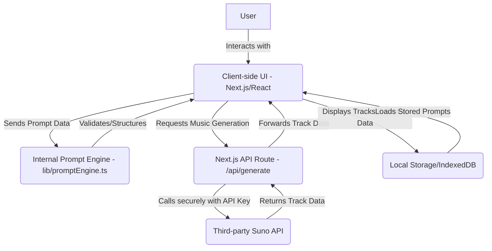

# Architecture Patterns

**Domain:** AI Music Generation Prompt Engineering
**Researched:** 2024-07-30

## Recommended Architecture

The `suno-forge` application will follow a client-server architecture, leveraging Next.js's full-stack capabilities to provide both a rich frontend experience and a secure backend API proxy.

### Component Boundaries

| Component                                         | Responsibility                                                                                                                                 | Communicates With                             |
| ------------------------------------------------- | ---------------------------------------------------------------------------------------------------------------------------------------------- | --------------------------------------------- |
| `Client_UI` (e.g., `app/page.tsx`, `components/`) | Renders user interface, captures input, displays generated results, manages client-side state.                                                 | `Prompt_Engine`, `API_Proxy`, `Local_Storage` |
| `Prompt_Engine` (`lib/promptEngine.ts`)           | Core business logic for prompt construction, validation, templating, mutation, and structuring based on Suno's requirements.                   | `Client_UI`                                   |
| `API_Proxy` (`app/api/generate/route.ts`)         | Receives prompt data from `Client_UI`, secures API key, makes calls to `Third_Party_Suno_API`, handles responses, and forwards to `Client_UI`. | `Client_UI`, `Third_Party_Suno_API`           |
| `Third_Party_Suno_API`                            | External service responsible for actually generating music based on the received prompts.                                                      | `API_Proxy`                                   |
| `Local_Storage` (via `lib/persistence.ts`)        | Client-side persistence layer for saving and loading user prompts, templates, and generation history.                                          | `Client_UI`                                   |

### Data Flow

1.  **Prompt Creation:** User enters musical descriptors and lyrics into the `Client_UI` (e.g., `PromptEditor`, `LyricsEditor` components).
2.  **Validation & Structuring:** The `Client_UI` passes input data to the `Prompt_Engine` to validate against expected Suno formats and structure it into a coherent prompt object.
3.  **Generation Request:** Upon user action (e.g., "Generate"), the `Client_UI` sends the structured prompt object to the `API_Proxy` (`/api/generate` endpoint).
4.  **Secure API Call:** The `API_Proxy` (running on the server) uses the stored secure API key to make a request to the `Third_Party_Suno_API` with the structured prompt.
5.  **Music Generation:** The `Third_Party_Suno_API` processes the prompt and generates music, returning track metadata (e.g., track IDs, preview URLs).
6.  **Result Delivery:** The `API_Proxy` receives the track metadata and forwards it back to the `Client_UI`.
7.  **Display & Persistence:** The `Client_UI` displays the generated music tracks (e.g., embedded players, links). Concurrently, the prompt used and the generated results are saved to `Local_Storage` for history and future reference.

## Patterns to Follow

### Pattern 1: Layered Architecture

**What:** Organizes code into distinct logical layers, each with specific responsibilities.
**When:** Ideal for maintaining separation of concerns, improving testability, and making the codebase easier to understand and evolve.
**Example:**

- **Presentation Layer:** Next.js/React components (UI).
- **Application/Domain Layer:** `Prompt_Engine` (business logic for prompts).
- **Infrastructure Layer:** `API_Proxy` (external service interaction), `Local_Storage` (data persistence).

### Pattern 2: Client-Server API Proxy

**What:** All requests to external APIs go through a server-side endpoint.
**When:** Essential when interacting with third-party APIs that require sensitive API keys, to prevent exposing them in the client-side code. Also useful for centralizing API logic, handling rate limits, and transforming data.
**Example:** The `app/api/generate/route.ts` acts as a proxy for the `Third_Party_Suno_API`.

### Pattern 3: Component-Based UI

**What:** Building the user interface as a collection of encapsulated, reusable components.
**When:** Standard practice in React applications for modularity, reusability, and maintainability.
**Example:** `PromptEditor`, `LyricsEditor`, `GeneratedTrackCard` components.

## Anti-Patterns to Avoid

### Anti-Pattern 1: Direct External API Calls from Client

**What:** Making calls to `Third_Party_Suno_API` directly from client-side React components.
**Why bad:** Exposes sensitive API keys to the public, making the application vulnerable to unauthorized usage. Bypasses server-side controls like rate limiting or data transformation.
**Instead:** Always use the `API_Proxy` to mediate calls to `Third_Party_Suno_API`.

### Anti-Pattern 2: Monolithic Prompt Logic

**What:** Embedding all prompt construction, validation, templating, and mutation logic directly within UI components.
**Why bad:** Leads to tightly coupled, hard-to-test, and difficult-to-maintain code. Logic becomes scattered and hard to reuse.
**Instead:** Encapsulate prompt-related business logic within a dedicated `Prompt_Engine` module (`lib/promptEngine.ts`).

## Scalability Considerations

| Concern                       | At 100 users (MVP)                                         | At 10K users                                                                                                                         | At 1M users                                                                                              |
| ----------------------------- | ---------------------------------------------------------- | ------------------------------------------------------------------------------------------------------------------------------------ | -------------------------------------------------------------------------------------------------------- |
| **Prompt Storage**            | Local Storage/IndexedDB (per browser)                      | Server-side Database (e.g., PostgreSQL, MongoDB) with user accounts                                                                  | Distributed database, caching layers, optimized query patterns                                           |
| **API Rate Limits**           | Handled by `API_Proxy`, potentially with basic retry logic | Intelligent queuing, more aggressive caching, distributed `API_Proxy` instances, potential for multiple third-party API integrations | Load balancing, dedicated API contracts with Suno/partners (if available)                                |
| **Computation (Client-side)** | Handled by user's browser                                  | Still primarily client-side; efficient UI rendering remains critical                                                                 | Efficient UI, potentially WebAssembly for complex client-side calculations, edge computing for UI assets |
| **Computation (Server-side)** | Minimal (API proxy overhead)                               | Could increase if complex server-side prompt processing or user authentication is added                                              | Serverless functions for API proxy, highly scalable backend for any custom logic.                        |

## Sources

- Next.js documentation (for architecture patterns)
- React best practices (for component structure)
- Web search results for "Suno AI API access developer" (for API proxy justification)
- General software architecture principles.
